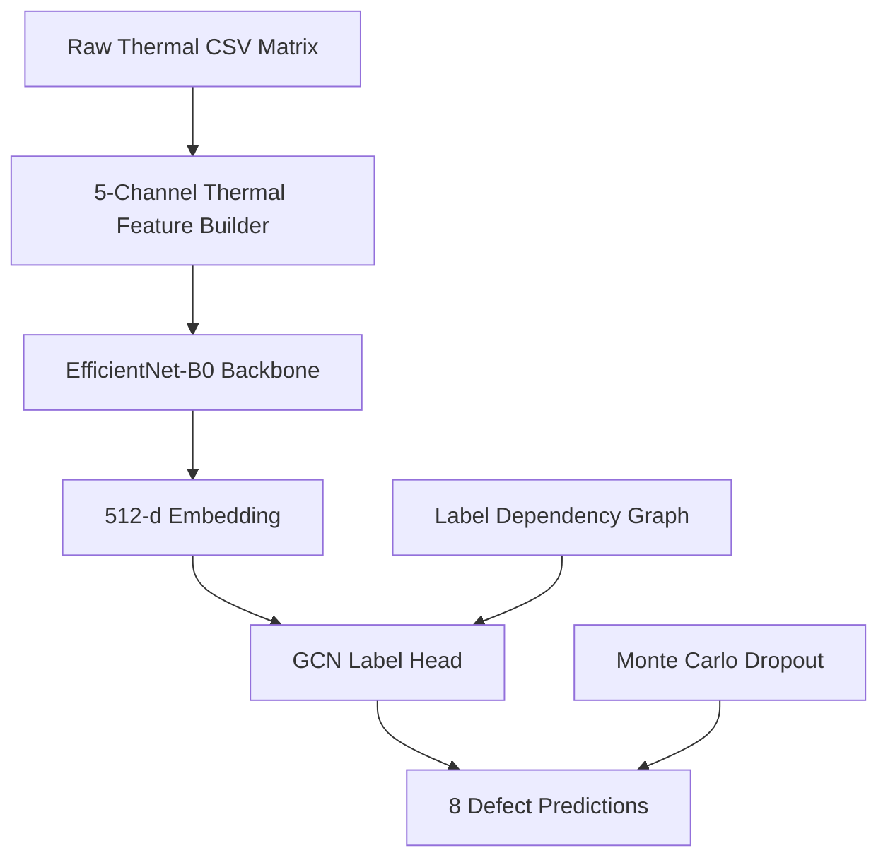

# Physics-Informed Thermal Defect Detection for Injection Moulding

Physics-informed, uncertainty-aware multi-label defect classification from raw IR thermal
matrices of injection-moulded plastic parts, using a hybrid EfficientNet + Graph Convolutional
Network classifier with Monte Carlo Dropout inference.

---

## Overview

This project extends a standard EfficientNet-B0 baseline with four architecture-level
improvements specifically motivated by thermal imaging and small-dataset industrial
quality control.

| Proposed Component | Purpose | Why it matters |
|---|---|---|
| **Raw float input + gradient channels** | Feeds raw CSV temperature matrices as float32 tensors with ∂T/∂x and ∂T/∂y appended as extra channels | Avoids quantisation loss from PNG conversion and exposes thermal defect signatures |
| **GCN label classifier head** | Models inter-label dependencies using a learned graph over the 8 labels | `LBL_NOK` depends structurally on `SinkMarks` and `Underfilled` |
| **Monte Carlo Dropout inference** | Keeps dropout active during inference across multiple forward passes | Produces calibrated uncertainty estimates per defect label |
| **Self-supervised SimCLR pre-training** | Pre-trains on unlabelled thermal matrices before supervised learning | Improves feature extraction under extremely limited labelled data |

---

## Problem

During injection moulding, deviations in process parameters produce surface and structural
defects. A robot positions each ejected part in front of an IR camera. The raw CSV thermal
matrix is processed in real time to simultaneously predict 8 defect labels before any
human inspection occurs.

| Label | Defect | Structural dependency |
|---|---|---|
| `LBL_SinkMarks` | Surface depression from insufficient packing | → determines `LBL_NOK` |
| `LBL_SprueCircle` | Circular mark around the sprue gate | — |
| `LBL_Underfilled` | Cavity not fully filled with melt | → determines `LBL_NOK` |
| `LBL_OldGranulate` | Contamination from previous material batch | — |
| `LBL_StreaksLevel1` | Light flow/moisture streaks | ordered severity |
| `LBL_StreaksLevel2` | Moderate streaks | ordered severity |
| `LBL_StreaksLevel3` | Severe streaks | ordered severity |
| `LBL_NOK` | Overall reject flag | `SinkMarks OR Underfilled` |

These dependencies are encoded explicitly inside the GCN adjacency matrix instead of
being learned purely from limited data.

---

## Dataset

- **Source:** ProBayes research project — SKZ + Fraunhofer IPA
- **Machine:** KraussMaffei 160-750PX injection moulding machine
- **Material:** Polypropylene (PP)
- **Size:** 156 labelled parts across 13 experiment series
- **Labels:** `dataset_V2.parquet`
- **Raw matrices:** `dataset_csv/`
- **Visual PNGs:** `dataset_images/`

### Image–Label Mapping

```text
IR_Image1Name in parquet : TDI_000020220317 06_24_53.736A1.csv
Corresponding raw matrix : dataset_csv/TDI_000020220317 06_24_53.736A1.csv
```

Rows whose thermal CSV matrices are missing are automatically removed during dataset loading.

---

## Thermal Sample

| Raw Thermal Image | Gradient Magnitude |
|---|---|
|  |  |

---

## Architecture



---

### 1. Physics-Informed Input Representation

Instead of loading PNG thermal images, the pipeline reads raw CSV matrices directly
as float32 tensors and constructs a 5-channel representation:

```text
Channel 0 : Raw temperature values (T)
Channel 1 : Spatial gradient ∂T/∂x
Channel 2 : Spatial gradient ∂T/∂y
Channel 3 : Gradient magnitude |∇T|
Channel 4 : Laplacian ∇²T
```

Thermal defects such as sink marks and underfilling produce characteristic spatial
gradient signatures. Supplying these channels explicitly improves learning efficiency
on small datasets.

The EfficientNet-B0 input layer is widened from 3 → 5 channels while preserving
pretrained ImageNet weights on the original channels.

---

### 2. Backbone — EfficientNet-B0

The backbone uses pretrained ImageNet weights with differential learning rates:

- Backbone LR: `1e-5`
- Classifier head LR: `1e-4`

---

### 3. Self-Supervised SimCLR Pre-Training

Before supervised fine-tuning, the backbone is optionally pre-trained using SimCLR
contrastive learning on all available thermal matrices.

```text
Augmentation A ──┐
                  ├─ EfficientNet ─ Projection Head ─ NT-Xent Loss
Augmentation B ──┘
```

Thermal-specific augmentations include:
- temperature jitter
- Gaussian noise
- horizontal flip
- random crop

---

### 4. GCN Label Classifier Head

The standard linear classification layer is replaced with a Graph Convolutional Network
operating over 8 label nodes.

```text
EfficientNet Features
        ↓
Linear(1280 → 512)
        ↓
ReLU + Dropout
        ↓
GCN Layer 1
        ↓
GCN Layer 2
        ↓
8 defect logits
```

### Adjacency Matrix Construction

The graph is built using:

1. Statistical label co-occurrence
2. Domain priors:
   - `SinkMarks → NOK`
   - `Underfilled → NOK`
   - `Streak severity chain`

The adjacency matrix is row-normalised and fixed during training.

---

### 5. Monte Carlo Dropout Inference

Dropout remains active during inference.

Each sample passes through the network multiple times (`N = 50`) to estimate:

```python
{
  "predictions": np.ndarray[8],
  "mean_logits": np.ndarray[8],
  "std_logits": np.ndarray[8],
  "uncertain_labels": list[str]
}
```

High-uncertainty samples are routed for human inspection.

---

## Full Pipeline

```text
dataset_csv/*.csv
        ↓
5-channel thermal tensor generation
        ↓
[Optional] SimCLR pre-training
        ↓
EfficientNet-B0 backbone
        ↓
GCN label dependency head
        ↓
BCEWithLogitsLoss + pos_weight
        ↓
Monte Carlo Dropout inference
        ↓
Threshold tuning
        ↓
Predictions + uncertainty
```

---

## Project Structure

```text
thermal-cnn/
├── dataset_csv/
├── dataset_images/
├── dataset_V2.parquet
├── src/
│   ├── dataset.py
│   ├── model.py
│   ├── gcn.py
│   ├── simclr.py
│   ├── train.py
│   ├── inference.py
│   └── utils.py
├── outputs/
│   └── models/
├── requirements.txt
└── README.md
```

---

## Setup

```bash
pip install -r requirements.txt
```

### requirements.txt

```text
torch>=2.0
torchvision>=0.15
pandas>=1.5
numpy>=1.23
scipy>=1.9
scikit-learn>=1.1
pyarrow>=10.0
tqdm>=4.64
```

Python 3.10+ recommended.

---

## Training

### Step 1 — SimCLR Pre-Training

```bash
python3 src/simclr.py \
    --csv_dir dataset_csv/ \
    --epochs 100 \
    --batch_size 8
```

---

### Step 2 — Supervised Fine-Tuning

```bash
python3 src/train.py --simclr outputs/models/simclr_backbone.pth
```

Training automatically performs:
- threshold tuning
- validation evaluation
- checkpoint saving

---

## Inference

```python
from src.inference import ThermalInferenceEngine

engine = ThermalInferenceEngine(
    model_path="outputs/models/best_model.pth",
    thresholds_path="outputs/models/best_thresholds.npy",
    n_passes=50
)

result = engine.predict("dataset_csv/sample.csv")
```

---

## Evaluation Metrics

| Metric | Purpose |
|---|---|
| Macro F1 | Rare-defect balanced evaluation |
| Micro F1 | Overall prediction quality |
| Per-label threshold tuning | Handles severe class imbalance |
| Expected Calibration Error (ECE) | Measures uncertainty calibration |

Accuracy is intentionally avoided because it is misleading in highly imbalanced
multi-label defect datasets.

---

## Results

| Model | Val Macro-F1 | Val Micro-F1 |
|---|---|---|
| Without SimCLR (baseline run) | 0.104 | — |
| + SimCLR pre-training, fixed threshold | 0.292 | 0.348 |
| + SimCLR pre-training, tuned thresholds | **0.375** | **0.348** |

The dataset contains only 156 labelled samples across 8 highly imbalanced labels.
Three labels (OldGranulate 2.1%, StreaksLevel2 3.2%, StreaksLevel1 5.3%) contain
fewer than 10 positive examples, making per-label F1 unreliable for those classes.
The primary contribution of this work is the physics-informed architecture and
uncertainty-aware inference pipeline rather than absolute benchmark performance.

---

## Configuration

```python
BATCH_SIZE            = 8
NUM_EPOCHS            = 80
LR                    = 1e-4
VAL_SPLIT             = 0.2
MC_DROPOUT_PASSES     = 50
UNCERTAINTY_THRESHOLD = 0.15
GCN_HIDDEN_DIM        = 256
SIMCLR_TEMPERATURE    = 0.07
```

---

## Key Engineering Decisions

### Raw float thermal input

PNG conversion compresses thermal precision. Direct CSV loading preserves full
sensor information.

### Explicit gradient channels

Thermal defects are often characterised by spatial temperature derivatives rather
than raw temperature values.

### GCN over flat classification

The GCN explicitly models structural dependencies between labels, improving
sample efficiency.

### SimCLR pre-training

Contrastive learning adapts the backbone to the thermal domain before supervised
training, improving macro-F1 from 0.104 to 0.375.

### Monte Carlo Dropout

Provides epistemic uncertainty estimation and enables human-in-the-loop inspection.

---

## Limitations

- Small dataset size (156 labelled samples)
- Single material and machine setup
- Three labels have fewer than 10 positive examples — macro-F1 is unstable for those classes
- Limited experiment diversity
- Uncertainty calibration may require further tuning

---

## Future Work

- Temporal thermal sequence modelling using ConvLSTM
- Vision Transformer backbone evaluation
- Edge deployment on Jetson Nano / Raspberry Pi
- Active learning for uncertain samples
- Multi-material generalisation

---

## References

- Tan & Le (2019). EfficientNet.
- Chen et al. (2020). SimCLR.
- Chen et al. (2019). ML-GCN.
- Gal & Ghahramani (2016). MC Dropout.

---